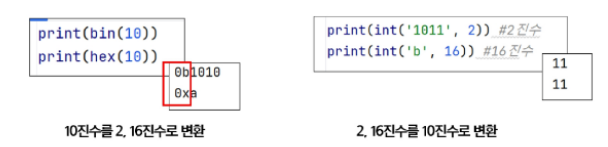

#  비트연산
- And
 - $ : 비트단위로 and 연산을 함
- Or
 - | : 비트단위로 or 연산을 함
  
## 파이썬에서 2진수, 16진수, 10진수 변환하여 출력
- 2진수는 *0b* 접두사
- 16진수는 *0x* 접두사

## 비트 XOR 연산자
- ^ : XOR연산자, 둘 다 1이거나 0인 경우는 0이다.(같으면 0, 다르면 1)
- 어떤 값이던 특정 수로 2회 ^하면 원래 수로 돌아옴

## 쉬프트 연산자
- Left Shift <<: 특정 수 만큼 비트를 왼쪽으로 밀어냄
- Right Shift >>: 특정 수 만큼 비트를 오른쪽으로 밀어냄(오른쪽 비트들 제거됨)
-  *ex]]* num<<2 *2회이동
- 왼쪽으로 n칸 밀면 숫자는 2^n배! (13 * 4 = 52)
- 오른쪽으로 n칸 밀면 숫자를 2^n으로 나눈 몫이 돼! (13 // 4 = 3)

## ~연산자
- 모든 비트 반전시킴

## 비트연산 응용
- 1 << n
 - 2^n의 값을 가짐
- 상태확인
 - if i & (1<<n): 
 - i의 n번째 비트가 1인지 아닌지 확인함
- 자리고정
 - i |= (1<<n)
 - i의 n번째 비트를 1로 고정함 
- 상태해제
 - i &= ~(1 << n)
 - i의 기존 데이터가 무엇이든 관계없이, n번째 위치의 비트를 무조건 0으로 설정하는 연산.
- 상태반전
 - i ^= (1 << n)
 - i의 n번째 위치의 비트 상태를 뒤집는(0이면 1로, 1이면 0으로 변환) 연산